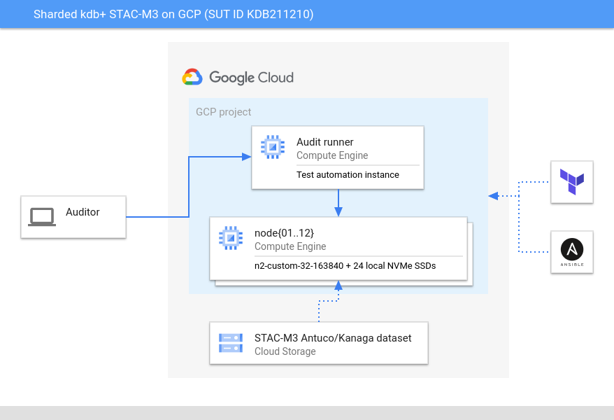

This is not an officially supported Google product.

## Overview
This repository contains deployment and execution scripts for the sharded kdb+ 4.0 STAC-M3 benchmark on Google Cloud.

## Prerequisites
This repository contains the portion of the code base that was written entirely by Google and released under the Apache 2 license. Reading the code will provide insight into how to run a STAC-M3 benchmark on Google Cloud, but it is most useful when combined with template snippets copyrighted by STAC Research and KX, available on the [STAC Report page](https://www.STACresearch.com/KDB211210). The contents of that code archive can be placed in the root of this repository as an overlay to enable the functionality needed to run a benchmark end to end. In addition, you will need:
- The kdb+ binaries and a valid license placed in `automation/ansible/roles/kdb/files`
- The kdb+ database sym file placed in `automation/ansible/roles/stac-m3/files`
- A pre-generated STAC-M3 data set stored in a Google Cloud Storage bucket (defaults to gs://$PROJECT_ID/stac-m3-data)

## Architecture

The benchmarking environment consists of 12 n2-standard-32 compute instances (Intel Cascade Lake, 32 vCPUs, 160 GiB memory), each with 24 local NVMe SSDs. The operating system is Ubuntu 20.04. The entire environment is managed by Terraform and Ansible. Terraform is used to create compute instances and DNS entries; Ansible is used to configure operating systems and install the benchmarking framework.

The M3 dataset is stored permanently in Google Cloud Storage. At the time the cluster is built data is copied from object storage to local NVMe SSDs on each instance. The dataset is sharded equally across all instances with day granularity.

The deployment scripts are idempotent; re-running them will drive the cluster to the correct state, including data synchronization, if nodes are lost for any reason.

## Repository Directory Structure
The top-level directory contains this readme and a central makefile that can be used to deploy the benchmarking environment. This makefile will run make in the `code` and `automation` directories, but will not execute the benchmarks themselves.

The `code` directory contains a makefile that will check out the STAC-M3 packs for kdb+ and the STAC-M3 test harness for use by the deployment scripts. This is a prerequisite for building the environment and running benchmarks. Code checkouts are pinned to the revisions used for KDB211210.

The `automation` directory contains Terraform definitions for the benchmarking environment and Ansible wrapper playbooks for installing and running the benchmark code contained in the `code` directory. It also contains a directory used to store and analyze results against prior benchmark runs.

## Deployment
All common actions are driven by makefiles. Running `make` in the top-level directory will check out the benchmarking code and deploy the full GCP environment. After checking out the code, you can execute the benchmarking scripts by either running `make (antuco|shasta|kanaga)` in the `automation` directory or logging on to `node01` and executing the scripts directly (see **Access and Execution** below).

You can also descend into subdirectories of the `automation` directory and run individual pieces of the automation framework (e.g., just build the infrastructure using Terraform but don't configure the OS or run benchmarks); read the respective makefiles in each directory for details.

## Access and Execution
Compute instances are exposed to the public internet through SSH and are named `node{01..12}.<fqdn>`. After your SSH key is added to the compute metadata of the project you will be able to log in to all nodes. All code and data is stored under `/m3` on each node. The directory structure is as follows:

* `/m3/data`: Contains mounts for each of the local NVMe SSDs. Each mounted volume contains the benchmark dataset from Cloud Storage.
* `/m3/run`: Contains the installation of kdb+, directories for each STAC-M3 benchmark, and wrapper scripts to run each benchmark. Each benchmark subdirectory contains the automation, code, and documentation from the original STAC-M3 repositories.
* `/m3/tmp`: Contains the database written by the write benchmark.

Benchmarks should be run as root (`sudo -i`). The easiest way to run a particular benchmark is to execute `/m3/run/tests/run-$BENCHMARK.sh`. To run an official automated audit, execute `/m3/run/automation/runm3.sh`.
